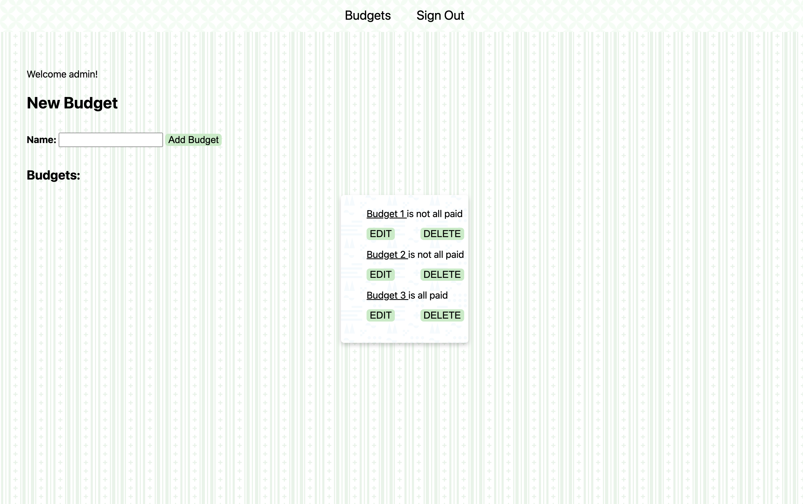

[Launch App](https://budget-tracking-app-5753c4b58f84.herokuapp.com)

# Budget Tracker App
This is a simple budget tracking app by Jonathan Cabrera.

## Planning material
[Trello Planning Board](https://trello.com/b/KvIrNLsh)

## How to Use
1. Create a new account.
2. Sign in.
3. Create a new budget.
    1. Ability to delete budget.
    2. Ability to edit budget name.
    3. Mark budget as all paid, or unpaid.
4. Create new expenses for the budget.
    1. Ability to delete expenses.
5. Users can only see their own budgets.

## Technologies Used
* VS Code
* Trello
* JavaScript
* EJS
* CSS
* HTML
* Node.js
* Mongoose
* MongoDB
* Express
* Git
* GitHub
* Heroku

## Credits
[Background](https://heropatterns.com) Made using Hero Patterns.
[Favicon](https://dodo.ac/np/images/c/c8/Animal_Crossing_Enciclopedia_Favicon.png) Found on [Nookipedia](https://nookipedia.com/wiki/Main_Page)

## Stretch Goals
1. Ability to edit expenses.
2. Feature that automatically sums up the total amount of expenses.